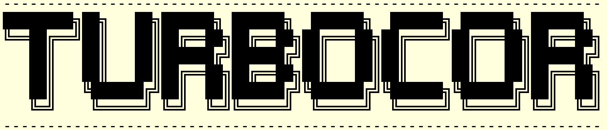
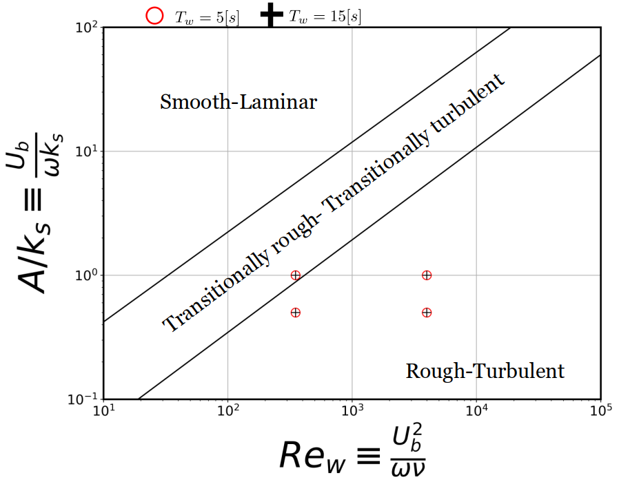

<!--- the logo -->

<center></center>

This repository stores all the pre-processing and post-processing code used in the SURFsara funded project titled `Unraveling the Turbulence Dynamics: Investigating Wave-Induced Turbulence over Corals [EINF-6125]` or in short `TURBOCOR`.

## Requirements

To enable swift error-free runtime environments, you can create a python environment and install the required libraries as shown below.

```
python -m venv <location to virtual environment>
source <location to virtual environment>/bin/activate
pip install -r requirements.txt
```

## Directory Layout

- `analysis`: Contains all the post-processing code used to obtain the results
- `preprocessing`: Contains all the routines to generate the stochastic coral bed and the signed-distance-field [SDF] used to generate the masking function within the code.
  - `generateCoralBed`: Python routines to generate the stochastic coral bed
  - `generateSDF`: Python routines to generate the SDF and convert the numpy arrays to `dopamine*` compatible binary files

## Wave-Roughness parameter space

The wave-roughness parameters are listed in the table and the figure below. The figure demarcations are adapted from Lacy and McVean (2016). The values within the table below were generated using the `preprocessing/generateCoralBed/param_space.py` script.

| Case Name | $Re_w$ [-] | $A/k_s$ [-] | $Re_k^b$ [-] | $U_b$ [m/s] | $T_w$ [s] | $k_s$ [m] |  Status  | Storage Location |   Backup   |
| :-------: | :----------: | :-----------: | :------------: | :-----------: | :---------: | :---------: | :-------: | :--------------: | :---------: |
|    c1    |     351     |       1       |      351      |   0.021002   |      5      |  0.016713  | Completed |  Noether [sto2]  | ICT storage |
|    c2    |     351     |       1       |      351      |   0.012125   |     15     |  0.028947  | Completed |  Noether [sto2]  | ICT storage |
|    c3    |     3990     |       1       |      3990      |   0.070809   |      5      |  0.056348  | Completed |  Noether [sto3]  | ICT storage |
|    c4    |     3990     |       1       |      3990      |   0.040882   |     15     |  0.097598  | Completed |  Noether [sto3]  | ICT storage |
|    c5    |     351     |      0.5      |      702      |   0.021002   |      5      |  0.033426  | Completed |  Noether [sto1]  | ICT storage |
|    c6    |     351     |      0.5      |      702      |   0.012125   |     15     |  0.057895  | Completed |  Noether [sto1]  | ICT storage |




<hr>

The coral geometries are openly available from the `Smithsonian archive` at [3D Digitisation][3D Digitisation] , and we would like to thank Smithsonian - 3D Digitisation for making these coral geometries freely available for public use.

<hr>

`*The code for dopamine was graciously shared by Prof. Adrian Lozano-Duran, and we would like to acknowledge the support and insights provided by Prof. Lozano-Duran.`

[3D Digitisation]: https://3d.si.edu/corals
